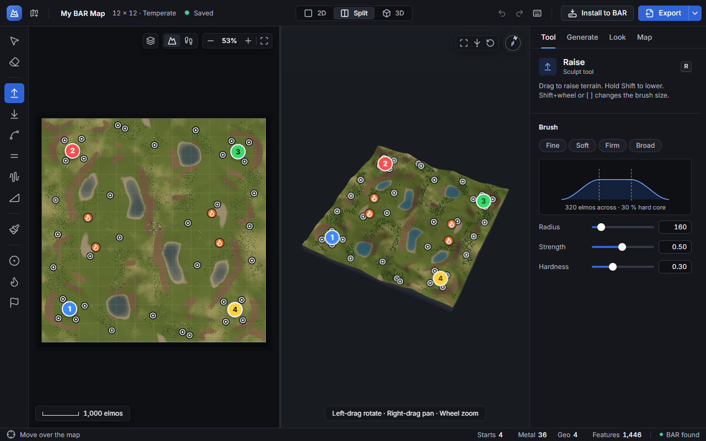

# BAR Map Studio

A Windows desktop app for making and editing maps for [Beyond All Reason](https://www.beyondallreason.info/) (BAR).
Generate terrain from templates, sculpt it, place resources, texture it with game-standard materials, open and
extend existing BAR maps, check the result in BAR's own engine and play-test it against an AI, all offline.



> **Status:** development is paused (2026-10-10). Waves 0–3 and most of Wave 4 are done and merged; the app is usable
> from source. Packaging (installer / portable exe), a second UI polish round and the final persona tests are not
> done. See [docs/STATUS.md](docs/STATUS.md).

## Features

- **New maps from templates**: Flat, Rolling hills, Mountains, Plateaus, Canyons, Islands, Two shores, Craters, and
  Volcano – King of the Hill (a one-way uphill assault with lava rivers). Sizes 2–32 map units, rectangular allowed,
  2–16 players, 8 symmetry modes, 7 biomes.
- **Sculpting**: raise, lower, smooth, flatten, roughen and ramp brushes, all mirrored by the map's symmetry, with
  undo/redo for everything.
- **Resources**: metal spots, geothermal vents and start positions, placed automatically for the player count or by
  hand; mirrored copies follow when you move one.
- **Game-standard look**: a library of 24 CC0 materials baked into BAR's full texture stack (diffuse tiles, splat
  distribution, detail normals, specular, grass, minimap). Slopes read the way BAR's map checklist asks: vehicle
  ground up to 27°, bot-only slopes 27–54°, cliffs above. Trees and rocks are BAR's own built-in features.
- **2D, 3D and split views**, a pathing overlay, overlays for features, labels and symmetry guides.
- **Open existing BAR maps** from your BAR maps folder (read-only), shown with their original textures. Edit them,
  **extend or crop them by whole map units on any side**, or resize them, then export a derivative that keeps every
  untouched file byte-for-byte and credits the original author.
- **Export** to BAR's `.sd7` format, with a **Share** preset that keeps a 32×32 map under 50 MB.
- **Install to BAR** (asks first and names anything it replaces; writes the `.md5.gz` sidecar).
- **Check map**: loads the export in BAR's headless engine and runs 15 automated checks from BAR's map checklist,
  with one-click fixes.
- **Play-test**: starts BAR with your map against the BARb AI, without installing the map.

## Requirements

- Windows 10 or 11, 64-bit.
- Node.js 24.2 or newer (to run from source).
- Beyond All Reason installed (for Install, Open existing map, Check map and Play-test). The app finds it in
  `%LOCALAPPDATA%\Programs\Beyond-All-Reason`.
- About 1 GB of disk space for dependencies and the texture library.

## Run from source

```
npm install
npm run textures
npm start
```

`npm run textures` downloads the 24 CC0 materials from ambientCG (about 440 MB of zips, cached in
`D:	ools	exture-cache
aw`; the path is set in `tools/textures/fetch.js`, change it on a machine without a D: drive)
and builds the texture library in `assets/textures/` (gitignored, about 120 MB). It only needs to run once. The app runs
without it, but exports and the material swatches need it.

`npm test` runs the test suite (about 2–3 minutes; some tests open the app window briefly). See
[docs/DEVELOPMENT.md](docs/DEVELOPMENT.md).

## Documentation

| Document | For |
|---|---|
| [docs/USER_GUIDE.md](docs/USER_GUIDE.md) | Using the app: every screen, tool, setting and workflow |
| [docs/DEVELOPMENT.md](docs/DEVELOPMENT.md) | Setting up, running, testing, the tools, conventions |
| [docs/ARCHITECTURE.md](docs/ARCHITECTURE.md) | Processes, the MapDoc model and every module's contract |
| [docs/STATUS.md](docs/STATUS.md) | What is done, what is left, known risks, open decisions |
| [tools/README.md](tools/README.md) | Verification tools: format validator, headless engine check, in-engine screenshots, checklist |
| [tools/textures/README.md](tools/textures/README.md) | How the texture library is fetched and built |
| [docs/PLAN.md](docs/PLAN.md), [docs/KICKOFF_PROMPT.md](docs/KICKOFF_PROMPT.md) | The original plan and requirements |
| [docs/gauntlet/](docs/gauntlet/WORKBENCH.md) | How it was built: bars, wave briefs, critic reports, screenshots |

## Repository layout

| Path | What |
|---|---|
| `app/` | Electron main process (`main.js`, `ipc.js`, `ipc-engine.js`), preload bridge, and the renderer UI (`app/renderer/`) |
| `src/core/` | MapDoc model, symmetry, history (undo/redo), reshape (extend/crop/resize) |
| `src/terrain/` | Templates, generators, brushes, erosion, resource placement, feature scatter |
| `src/look/` | Biomes, material library, texture bake, grass |
| `src/formats/` | SMF, SMT, DXT/DDS, TGA, metal map, `mapinfo.lua` / `lava.lua` writers |
| `src/archive/` | 7-Zip reading and `.sd7` writing, with safety checks |
| `src/bar/` | Export, derivative export, install, open, BAR engine runs, Check map, Play-test, checklist |
| `src/import/` | Reading an existing map archive into a MapDoc |
| `src/lua/` | Sandboxed Lua (wasmoon) for reading `mapinfo.lua` and map configs |
| `tests/` | `node:test` tests, including Playwright tests of the real app |
| `tools/` | Validator, engine check, in-engine screenshots, checklist CLI, blind A/B tool, texture pipeline |
| `docs/` | Documentation and the build history |
| `legacy/` | The first browser prototype, kept for reference only |

## Licence and credits

No licence has been chosen for this project yet (`"license": "UNLICENSED"` in `package.json`): all rights reserved
by the owner.

Third-party components:

| Component | Licence |
|---|---|
| [Electron](https://www.electronjs.org/) | MIT |
| [three.js](https://threejs.org/) | MIT |
| [wasmoon](https://github.com/ceifa/wasmoon) (Lua 5.4 in WebAssembly) | MIT |
| [Lucide](https://lucide.dev/) icons | ISC |
| [Inter](https://rsms.me/inter/) font (`@fontsource-variable/inter`) | SIL Open Font License 1.1 |
| [7-Zip](https://www.7-zip.org/) via `7zip-bin` | LGPL (7-Zip), MIT (package) |
| Materials from [ambientCG](https://ambientcg.com/) | CC0 1.0 (list with sources and SHA-256 in `assets/textures/LICENSES.md` after `npm run textures`) |
| Playwright (tests only) | Apache 2.0 |

Beyond All Reason, its engine (Recoil) and its maps belong to their authors. The app never copies textures or models
out of other people's maps into itself; a derivative of an existing map passes that map's own files through and
credits its author, and warns when the map's licence forbids derivatives or commercial use.
