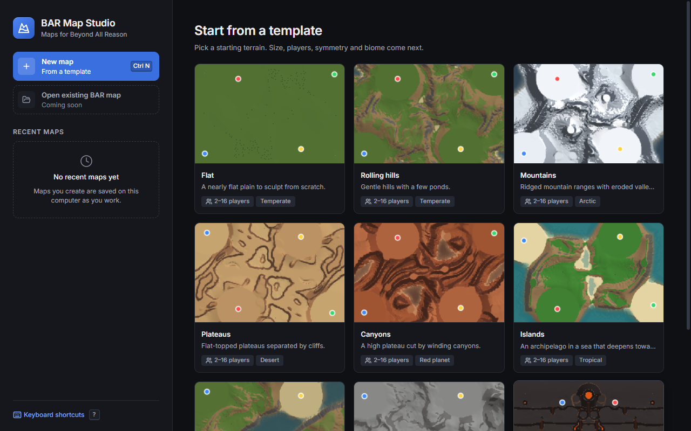
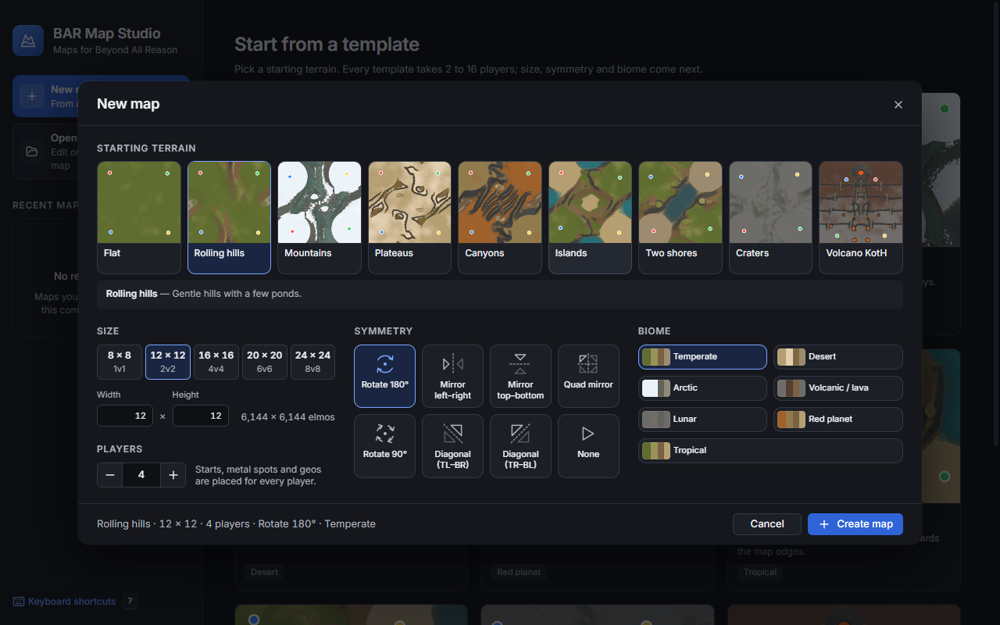
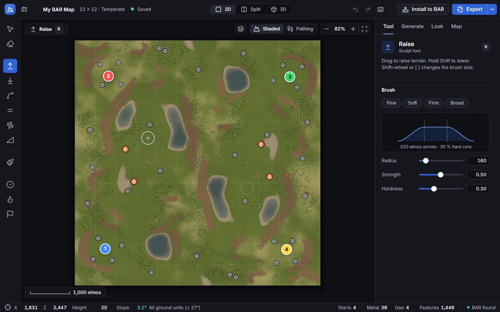
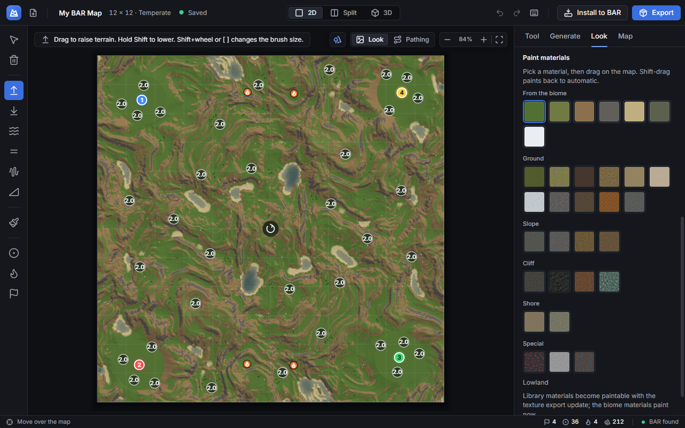
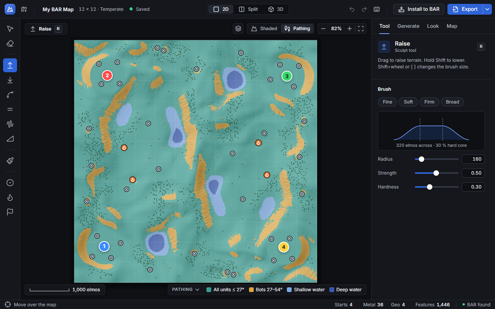
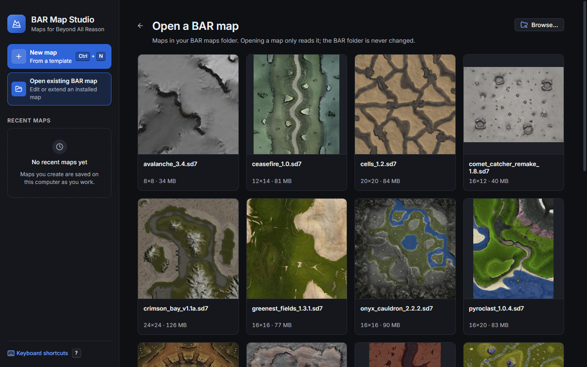
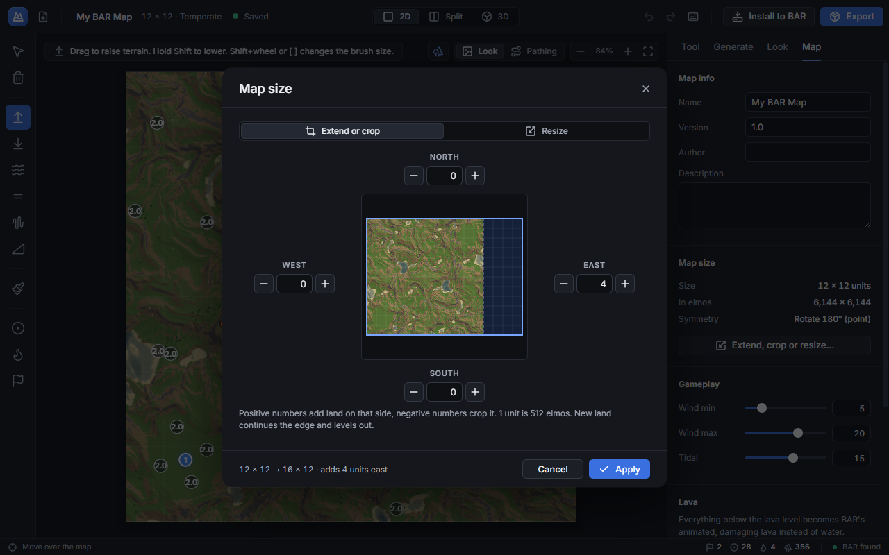
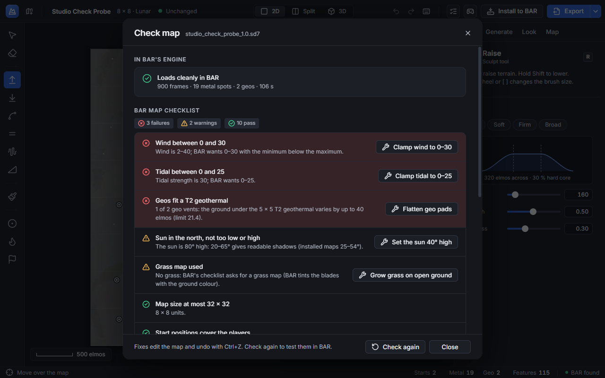

# BAR Map Studio user guide

This guide walks through every screen of BAR Map Studio. It assumes no map-making experience. Words that BAR players
use are explained the first time they appear.

- [Concepts](#concepts)
- [Welcome screen](#welcome-screen)
- [Making a new map](#making-a-new-map)
- [The editor](#the-editor)
- [Tools](#tools)
- [Inspector tabs](#inspector-tabs)
- [Views and overlays](#views-and-overlays)
- [Opening an existing BAR map](#opening-an-existing-bar-map)
- [Extend, crop or resize](#extend-crop-or-resize)
- [Exporting](#exporting)
- [Installing into BAR](#installing-into-bar)
- [Check map](#check-map)
- [Play-test](#play-test)
- [Saving and recent maps](#saving-and-recent-maps)
- [Keyboard shortcuts](#keyboard-shortcuts)
- [Walkthroughs](#walkthroughs)
- [Troubleshooting](#troubleshooting)

## Concepts

| Term | Meaning |
|---|---|
| **Elmo** | BAR's unit of distance. A tank is roughly 40 elmos long. |
| **Map unit** | 512 elmos. Map sizes are given in units, e.g. a 12 × 12 map is 6,144 × 6,144 elmos. BAR maps are 2 to 32 units per side, in even numbers. |
| **Metal spot** | A patch of metal where players build metal extractors. Its number (e.g. 2.0) is how much metal it gives. |
| **Geo vent** | A geothermal vent. Players build a geothermal power plant on top, so the ground around it must be flat. |
| **Start position** | Where a player's commander starts. One per player, in team order. |
| **Symmetry** | Most competitive maps are mirrored so every side gets the same terrain and resources. The editor mirrors every brush stroke and every placed object for you. |
| **Biome** | The look of the map: temperate, desert, arctic, volcanic, lunar, red planet or tropical. It chooses the materials, light, water and trees. |
| **Traversability** | Which units can cross which ground. BAR's limits: vehicles up to 27° slope, bots up to 54°, nothing steeper. The texturing makes these three classes look different. |
| **.sd7** | The archive format BAR uses for maps (a 7-Zip file). |

## Welcome screen

- **New map** (Ctrl+N) opens the New map dialog.
- **Open existing BAR map** lists the maps in your BAR maps folder. See [Opening an existing BAR map](#opening-an-existing-bar-map).
- **Recent maps** lists maps you have worked on. Click a row to reopen it. Each row has a Remove button (asks first).
- **Start from a template** shows every terrain template with a live preview. Clicking one opens the New map dialog
  with that template chosen.
- **Keyboard shortcuts** (or `?`) shows every shortcut.

## Making a new map

1. **Starting terrain**: pick a template.

   | Template | What you get |
   |---|---|
   | Flat | A nearly flat plain to sculpt from scratch. |
   | Rolling hills | Gentle hills with a few ponds; most ground is vehicle-passable. |
   | Mountains | Ridged mountain ranges with eroded valleys. |
   | Plateaus | Flat-topped plateaus separated by cliffs. |
   | Canyons | A high plateau cut by winding canyons. |
   | Islands | An archipelago in a sea that deepens towards the map edges. |
   | Two shores | Two land masses facing each other across a sea channel. |
   | Craters | Moon-like ground pocked with craters. |
   | Volcano – King of the Hill | A one-way uphill assault. Attackers start in the southern lowlands; the kings hold a volcano summit in the north. Four cliff tiers with fewer, narrower ramps the higher you go, and two lava rivers splitting three lanes. Half the players are kings. Its symmetry is fixed (mirror left–right). |

2. **Size**: presets 8 × 8 (1v1), 12 × 12 (2v2), 16 × 16 (4v4), 20 × 20 (6v6), 24 × 24 (8v8), or a custom width and
   height (even numbers, 2–32; rectangular maps are allowed).
3. **Players**: 2–16. Start positions, metal spots and geo vents are placed for this many players.
4. **Symmetry**: None, Mirror left–right, Mirror top–bottom, Rotate 180°, Quad mirror, Rotate 90°, Diagonal (TL–BR),
   Diagonal (TR–BL). The last three need a square map.
5. **Biome**: Temperate, Desert, Arctic, Volcanic / lava, Lunar, Red planet, Tropical.

The summary line at the bottom reads back your choices. **Create map** generates the terrain, places the resources
and scatters trees and rocks.

## The editor

| Area | What it holds |
|---|---|
| **Top bar** | Map name (click to rename), size and biome, save state; 2D / Split / 3D switch; Undo / Redo (the tooltip names the step); Keyboard shortcuts; Check map; Play-test; Install to BAR; Export (with an options arrow) |
| **Tool rail** (left) | The editing tools, grouped: Edit, Sculpt, Texture, Resources |
| **Viewport** (centre) | The map in 2D, 3D or both side by side |
| **Inspector** (right) | Tabs: Tool, Generate, Look, Map |
| **Status bar** (bottom) | Cursor position (X, Z), height and slope (coloured by traversability class), counts of starts, metal, geos and features, and whether BAR was found |

Everything you do can be undone with Ctrl+Z and redone with Ctrl+Y or Ctrl+Shift+Z.

## Tools

| Tool | Key | Use |
|---|---|---|
| Select | V | Click a metal spot, geo vent or start position to select it; drag to move it (mirrored copies follow); Del deletes it. A selected metal spot shows its position and value in the inspector. |
| Delete | X | Click a resource to delete it and its mirrored copies. |
| Raise | R | Drag to raise the ground. Shift lowers. |
| Lower | L | Drag to lower the ground. Below height 0 is water (or lava if lava is on). Shift raises. |
| Smooth | S | Drag to smooth bumps and soften cliffs. |
| Flatten | F | Drag to flatten to the height where the stroke started. Alt+click picks a fixed height first. |
| Roughen | N | Drag to add natural roughness. Shift subtracts. |
| Ramp | A | Drag a line from one height to another to cut a ramp between plateaus. Make ramps gentle (under 27°) if vehicles should use them. |
| Paint | P | Drag to paint a material over the automatic texturing. Shift erases back to automatic. Pick the material in the Look tab. |
| Metal | M | Click to place a metal spot. Drag to move, right-click to delete. |
| Geo | G | Click to place a geothermal vent. Keep the ground under it flat. |
| Start | T | Click to place a start position (one per player, in team order). |

**Brush settings** (Tool tab): presets Fine, Soft, Firm and Broad, a live falloff curve, and sliders for Radius
(elmos), Strength and Hardness (how much of the brush works at full strength). `[` and `]` or Shift+wheel change the
radius.

Every stroke and placement is mirrored by the map's symmetry; the brush cursor shows the mirrored copies.

## Inspector tabs

### Tool
The active tool's name, key and how to use it, plus the brush settings above.

### Generate
- **Terrain**: Template, Players, Seed (with a dice button for a random seed) and **Generate terrain**, which replaces
  the terrain, resources and features (undoable).
- **Resources**: **Auto-place resources** places start positions, metal spots and geo vents for the player count,
  mirrored by the symmetry, on flat pads. **Remove all resources** asks first.

### Look

- **Biome**: changes the whole look (materials, light, water, tree types). If the map's sun is in the south (BAR wants
  it in the north), a warning and a **Move sun north** button appear. **Grass on all open ground** grows BAR's grass on
  all ground vehicles can cross, not only on grassy materials.
- **Paint materials**: the biome's own materials and the 24-material library, grouped by class (ground, slope, cliff,
  shore, special). Hover a swatch for its name; the selected one is named under the grid. Used by the Paint tool.
- **Features**: trees and rocks (BAR's built-in features). Set the density, choose trees and/or rocks, then **Scatter
  features**. They are kept off ramps, start areas, metal and geo pads and chokepoints.

### Map
- **Map info**: Name, Version, Author, Description. For a map opened from BAR it also shows "Based on <map> by
  <author>".
- **Map size**: size in units and elmos, the symmetry, and **Extend, crop or resize…** (see below).
- **Gameplay**: Wind min / max (0–30) and Tidal (0–25), which set the energy from wind and tidal generators.
- **Lava**: **Lava instead of water** turns everything below the level into BAR's animated, damaging lava, and
  **Level** sets its height.

## Views and overlays

- **2D** (key 1), **Split** (key 2) and **3D** (key 3). In Split you can drag the divider (or focus it and use the
  arrow keys).
- **2D view**: wheel zooms, Space+drag or middle/right-drag pans, Home fits the map. The toolbar has **Overlays**
  (Features, Labels for metal values, Symmetry guides), **Shaded / Pathing**, zoom and fit. A scale bar shows
  distances.
- **Pathing overlay** colours the ground by who can cross it: all ground units, bots only, impassable, and water.
  The legend lists the classes present on the map.
- **3D view**: left-drag rotates, right-drag pans, wheel zooms. The toolbar has **Fit**, **Top view** and **Reset
  camera**; the compass shows north (click it to face north).

## Opening an existing BAR map

1. On the welcome screen choose **Open existing BAR map**. Every map in your BAR maps folder is listed with its
   minimap, size and file size. **Browse…** opens any other `.sd7` / `.sdz` file.
2. Click a map. It opens in a few seconds (a 32 × 32 map in about 3 s) with its original textures, metal spots, geo
   vents, start positions and lava.

Opening only reads the archive; the BAR folder is never changed. Archives with unsafe contents (links, paths outside
the archive, oversized files) are refused before anything is extracted, and a map whose Lua takes too long to read is
stopped after 10 seconds.

You can sculpt, place resources, extend or crop the map and change its settings. Painting over the original texture
is not exported yet (the export report says so).

## Extend, crop or resize

Map tab → **Extend, crop or resize…**:

- **Extend or crop**: set North, East, South and West in whole map units. Positive adds land on that side, negative
  crops it. The preview shows the old outline dashed, the new one in blue, new ground tinted and cropped ground
  dimmed. New land continues the edge and levels out gently.
- **Resize**: set a new width × height (even units, 2–32). The terrain and objects are rescaled; heights are not.
  On an opened map, resizing drops the original textures (they cannot be rescaled), and the dialog warns you.

Before applying, a confirm lists what will be lost: objects outside a crop (and how many start positions remain), a
symmetry that no longer fits, and original textures dropped by a resize. The change is one undo step.

## Exporting

Click **Export** (Ctrl+E). The arrow next to it holds the options:

| Option | Meaning |
|---|---|
| **Share · ≤ 50 MB** (default) | Keeps the archive under 50 MB for sharing and downloads; textures are slightly softer. |
| **Standard** | Full texture detail. A larger archive (a 32 × 32 map is about 160 MB), fine for local play and testing. |
| **Change export folder…** | Pick where archives are written. |

The first export asks for a folder and remembers it. The BAR maps folder is refused as an export folder: use
**Install to BAR** for that. The file is named `<name>_<version>.sd7` in lower case.

A card shows each step with its time and a progress bar; you can keep editing, or **Cancel**. When it is done, the
card shows the file, its size and the time taken, with **Copy path**, **Show in folder** and **Install to BAR**. Any
warnings from the export are listed. If a file of the same name exists and the app did not write it, you are asked
before it is replaced.

A 32 × 32 map exports in about 15–20 seconds.

**Exporting a map you opened from BAR** makes a derivative:

- It must have its own name or version. If it clashes with the original, you are asked for a new version (for
  example `1.0.4-edit1`).
- If the original's licence forbids derivatives (ND) or commercial use (NC), a warning explains what that means;
  **Export for personal use** continues.
- Every file you did not change is copied unchanged from the original archive; the map info credits the original
  author ("Based on <map> <version> by <author>").
- Extended ground is textured with the map's closest biome and blended into the original at the seam.

## Installing into BAR

**Install to BAR** exports (if needed) and copies the archive into BAR's maps folder, with the `.md5.gz` file BAR
uses to check it. It always asks first and names any older copy of the same map it would replace. Restart BAR (or
reload the lobby) to see the map.

## Check map

**Check map** (top bar) exports the map if it changed, then:

1. **In BAR's engine**: loads it in BAR's headless engine for 30 seconds of game time (about 2 minutes in total) and
   reports whether it loaded cleanly, with the metal spots, geo vents and lava BAR saw.
2. **BAR map checklist**: 15 automated checks from BAR's map checklist, each pass, warning or failure with the reason:
   size, start positions, wind and tidal ranges, sun direction and height, splat textures, detail normals, specular,
   grass, minimap brightness, metal spots, geo pads, features, fog and ground lighting.

Many checks have a **Fix** button (clamp wind or tidal, move the sun north, place start positions, grow grass on open
ground, flatten geo pads). Fixes are normal edits you can undo. **Check again** re-runs everything.

The check runs isolated: nothing is installed and the BAR folder is not changed.

## Play-test

**Play-test** (top bar) asks for the AI difficulty (Easy · Slow, Medium · Lazy, Hard · Balanced, Hard · Aggressive)
and your faction (Armada, Cortex, Random), exports the map if it changed, and starts BAR in a window with you against
one BARb AI on your map. The map is not installed: BAR runs with its own temporary folders and a copy of your BAR
settings, so your graphics and key settings apply. BAR takes a minute or two to load.

## Saving and recent maps

The open map is saved automatically about 1.5 seconds after each change, and when you close the window. The top bar
shows the save state. A map opened from BAR is only saved once you change it ("Unchanged" until then).

Saved maps appear under **Recent maps** on the welcome screen. Nothing is ever removed automatically; use the Remove
button on a row to delete one. If saved maps use a lot of space (over about 1 GB), a notice appears.

Saved maps live in the app's data folder (`%APPDATA%\bar-map-studio`). They are not BAR map files; export to get one.

## Keyboard shortcuts

| Group | Action | Keys |
|---|---|---|
| File | New map | Ctrl+N |
| File | Export | Ctrl+E |
| Edit | Undo | Ctrl+Z |
| Edit | Redo | Ctrl+Y or Ctrl+Shift+Z |
| Edit | Delete selection | Del |
| Edit | Delete under cursor | Right-click |
| Tools | Select, Delete, Raise, Lower, Smooth, Flatten, Roughen, Ramp, Paint, Metal, Geo, Start | V, X, R, L, S, F, N, A, P, M, G, T |
| Brush | Smaller / larger brush | [ / ] |
| Brush | Resize brush | Shift+wheel |
| Brush | Opposite stroke | Shift+drag |
| Brush | Pick flatten height | Alt+click |
| View | 2D / Split / 3D | 1 / 2 / 3 |
| View | Fit map to view | Home |
| View | Zoom | Wheel |
| View | Pan | Space+drag, or middle- or right-drag |
| 3D view | Rotate / pan / zoom | Left-drag / right-drag / wheel |
| Help | Keyboard shortcuts | ? |
| Help | Close a dialog or card | Esc |

## Walkthroughs

### A 2v2 forest map with a river

1. New map → **Rolling hills**, 12 × 12 (2v2), 4 players, **Mirror left–right**, **Temperate** → Create map.
2. Pick **Lower** (L), raise the radius with `]`, and drag a river from north to south down the middle (the mirror
   keeps both banks equal). Smooth (S) the banks.
3. Look tab → Features → density about 60, Trees on → **Scatter features**.
4. Check map → apply any fixes → Check again.
5. Export (Share) → **Install to BAR**.

### Extend Pyroclast and add geo vents

1. Welcome → Open existing BAR map → Pyroclast.
2. Map tab → Extend, crop or resize… → East 4 → Apply.
3. Pick **Geo** (G) and click twice on flat ground in the new area.
4. Export. When asked, keep the suggested version (e.g. `1.0.4-edit1`); read the licence note and continue.
5. Check map to confirm BAR loads it.

### Re-texture a map and keep it under 50 MB

1. Open the map (or your own), Look tab → choose another biome.
2. Export with **Share · ≤ 50 MB**.

### Fix a checklist failure

1. Check map. Read the failing rows (red).
2. Click each **Fix** button (or fix it by hand, e.g. flatten a geo pad with the Flatten tool).
3. Check again until every row passes.

## Troubleshooting

| Problem | What to do |
|---|---|
| "BAR not found" in the status bar | BAR must be installed in `%LOCALAPPDATA%\Programs\Beyond-All-Reason`. Install, Open existing map, Check map and Play-test need it. |
| Material swatches are plain colours / export fails about textures | The texture library is missing: run `npm run textures` once (see the README). |
| Export says the name has no letters or digits | Give the map a name with at least one letter or digit (Map tab or the top bar). |
| Export refuses the folder | The BAR maps folder can't be an export folder. Choose another folder and use Install to BAR. |
| Export says the sun must be in the north | Look tab → **Move sun north**. |
| A map won't open: "Refused …" | The archive contains links, paths outside the archive or oversized files. It is refused for safety. |
| A map won't open: "this map's Lua took too long to read" | Its `mapinfo.lua` takes too long to run; it cannot be opened. |
| "The original map changed on disk since you opened it" | The original archive was updated or replaced; reopen it and redo the edits. |
| Check map fails with engine errors | The failures list names the files involved. Fix them (or report them) and Check again. |
| The installed map does not show up in BAR | Restart BAR or reload the lobby. |
